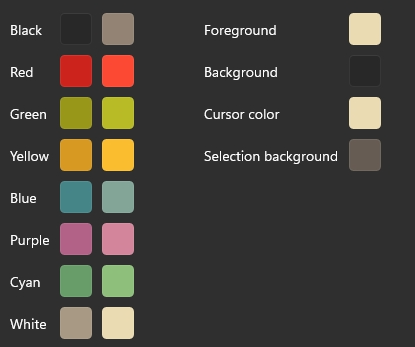

## rime-gruvboxdark-theme
### 安装
#### weasel小狼毫


使用weasel.yaml文件
- **颜色主题**
将preset_color_schemes下的yaml内容添加进**用户文件夹**中的weasel.yaml下的preset_color_schemes，具体参考自带的皮肤配置。
- **输入法配置**
将style下的yaml内容添加进**用户文件夹**中的weasel.custom.yaml
### Color RGB Code
gruvbox-dark的颜色代码
```json
{
    "background": "#282828",
    "black": "#282828",
    "blue": "#458588",
    "brightBlack": "#928374",
    "brightBlue": "#83A598",
    "brightCyan": "#8EC07C",
    "brightGreen": "#B8BB26",
    "brightPurple": "#D3869B",
    "brightRed": "#FB4934",
    "brightWhite": "#EBDBB2",
    "brightYellow": "#FABD2F",
    "cursorColor": "#EBDBB2",
    "cyan": "#689D6A",
    "foreground": "#EBDBB2",
    "green": "#98971A",
    "name": "GruvboxDark",
    "purple": "#B16286",
    "red": "#CC241D",
    "selectionBackground": "#665C54",
    "white": "#A89984",
    "yellow": "#D79921"
}
```

